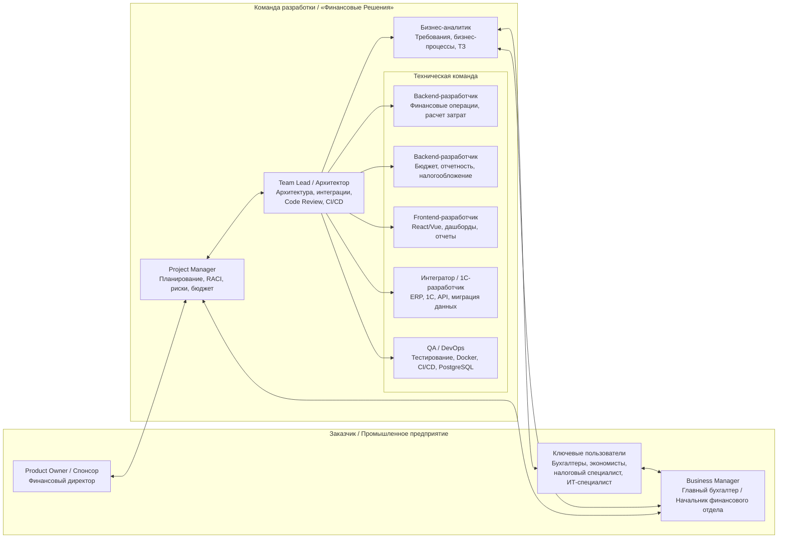
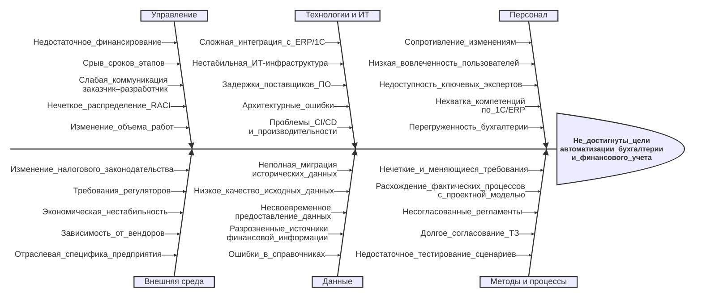
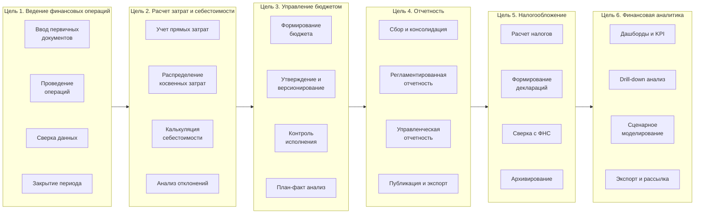

# Оглавление
- [Практика 1-4](#практика-1-4)
    - [Организационная диаграмма](#организационная-диаграмма)
    - [Анализ участников проекта](#анализ-участников-проекта)
    - [Три способа выявления проблем](#результаты-использования-трех-способов-выявления-проблем-с-выявленными-проблемами)
        - [1. Диаграмма Ишикавы](#1-диаграмма-ишикавы)
        - [2. SWOT-анализ](#2-swot-анализ)
        - [3. Анализ методом «5 Why»](#3-анализ-методом-5-why)
    - [Логико-структурная матрица проекта](#логико-структурная-матрица-проекта)
- [Практика 5-8](#практика-5-8)
    - [Цели и шаги](#цели-и-шаги-для-достижения-целей)
    - [User Story Map](#пользовательские-истории-и-mvp)
    - [Границы MVP](#границы-mvp)
    - [Инварианты](#известные-инварианты)
    - [Особенности разработки](#особенности-разработки-которые-должна-учесть-команда)

---

Тема: "Создание интегрированной системы автоматизации бухгалтерии и финансового учета промышленного предприятия для компании «Финансовые Решения»"

**ЭФМО-01-25**
- Коляда Даниил
- Бакланова Екатерина
- Борисов Денис

# Практика 1-4

## Организационная диаграмма

## Анализ участников проекта

| Группа участников | Выгода / Интересы | Требования к участию | Механизм участия | Риски и допущения |
|-|-|-|-|-|
| **Спонсор / Заказчик** | **+** Получение точной и своевременной финансовой аналитики для стратегических решений. **+** Оптимизация бюджета и контроль затрат. **-** Риск превышения бюджета или сроков проекта. | Утверждение бюджета, стратегических целей и приемка ключевых вех. | Еженедельные статус-встречи с PM. Участие в стратегических сессиях. Утверждение отчетов. | **Риски:** Изменение приоритетов бизнеса, сокращение финансирования. **Допущения:** Заказчик участвует в процессах принятия решений и согласований, обеспечивает поддержку на уровне руководства. |
| **Главный бухгалтер / Начальник отдела бухгалетрии** | **+** Упрощение процесса закрытия периода и подготовки отчетности. **+** Снижение количества ошибок. **-** Необходимость адаптации к новым регламентам работы. | Согласование ТЗ, методологии учета и участие в приемочном тестировании. | Рабочие группы по сбору требований. Регулярные демо-презентации. Приемочные испытания. | **Риски:** Сопротивление изменениям, нечеткие требования с его стороны. **Допущения:** Выделяет ключевых экспертов для работы с бизнес-аналитиком и тестированием. |
| **Ключевые пользователи (бухгалтеры, экономисты, налоговые специалисты и т.д.)** | **+** Автоматизация рутины, удобный интерфейс, снижение нагрузки. **-** Страх сокращения штата или увеличения нагрузки в период внедрения. | Предоставление обратной связи по юзабилити, тестирование сценариев, участие в обучении. | Опросы, фокус-группы. Баг-репорты в системе трекинга. Обучение и интерактивные сессии. | **Риски:** Низкая вовлеченность, саботаж внедрения. **Допущения:** Пользователи мотивированы на улучшение условий труда и готовы учиться. |
| **IT команда заказчика** | **+** Современная, поддерживаемая ИТ-инфраструктура. **-** Дополнительная нагрузка по поддержке нового ПО и обеспечению безопасности. | Обеспечение интеграции с текущей инфраструктурой, соблюдение политик безопасности. | Технические совещания с командой разработки. Передача документации. Совместное развертывание. | **Риски:** Нехватка компетенций, конфликт с текущими ИТ-стандартами. **Допущения:** ИТ-служба готова выделить ресурсы для интеграции и тестирования. |
| **Команда разработки** | **+** Успешная реализация проекта, прибыль, укрепление репутации. **-** Переработки, риск выгорания из-за сжатых сроков. | Четкие и стабильные требования, доступ к экспертам заказчика, своевременное финансирование. | Agile-спринты (Scrum/Kanban), ежедневные статусы, ретроспективы. Демо для заказчика. | **Риски:** «Расползание» требований (scope creep), задержки со стороны заказчика. **Допущения:** Команда укомплектована необходимыми специалистами (1С, Backend, Frontend). |

## Результаты использования трех способов выявления проблем с выявленными проблемами

### 1. Диаграмма Ишикавы

---

### 2. SWOT-анализ

| **Сильные стороны** | **Слабые стороны** |
|-|-|
| 1. Автоматизация рутинных операций бухгалтерии и расчета затрат, что снижает трудозатраты. 2. Централизованное хранение данных и возможность получения финансовой аналитики в реальном времени. 3. Интеграция с существующими ERP/1С системами предприятия, что обеспечивает целостность данных. 4. Наличие специализированных модулей под нужды промышленного предприятия (бюджетирование, налогообложение). | 1. Высокая сложность интеграции с устаревшим или нестандартным ИТ-ландшафтом заказчика. 2. Значительные ресурсные и временные затраты на разработку, миграцию данных и поддержку. 3. Возможное сопротивление изменениям со стороны бухгалтеров и экономистов (привычка к старым методам). 4. Потребность в длительном обучении персонала работе с новыми модулями. 5. Жесткие требования к точности миграции и надежности хранения исторических данных. |
| **Возможности** | **Угрозы** |
| 1. Повышение качества управления финансами и скорости принятия управленческих решений. 2. Снижение операционных расходов за счет уменьшения бумажной работы и ошибок ручного ввода. 3. Масштабируемость решения — возможность предложить продукт другим промышленным предприятиям. 4. Соответствие современным тенденциям цифровизации промышленности. | 1. Изменения в законодательстве (налоги, бухучет), требующие срочной доработки системы. 2. Риск технических сбоев или потери данных в период внедрения, что может парализовать и/или повредить финансовую отчетность. 3. Необходимость гарантий ненарушения процессов аудита. 4. Срыв сроков поставщиками смежного ПО по интеграции. 5. Утечка конфиденциальных финансовых данных. |

---

### 3. Анализ методом «5 Why»

**Прогнозируемый риск:** Существует высокая вероятность того, что после внедрения системы бухгалтеры и экономисты вернутся к использованию старой системы (Excel) для нестандартных расчетов, что приведет к расхождениям данных и срыву сроков закрытия отчетного периода.

1. **Почему существует риск возврата к старому ПО?**
   *Потому что разрабатываемая система может не учитывать все ежедневные рабочие сценарии и нестандартные расчетные таблицы, которые рядовые специалисты используют сейчас.*
2. **Почему система может не учитывать эти сценарии?**
   *Потому что на этапе сбора требований основное внимание уделяется регламентированной отчетности для руководства, а не ежедневной рутине рядовых пользователей.*
3. **Почему на этапе сбора требований упускается рутина рядовых пользователей?**
   *Потому что в план проекта не заложены обязательные мероприятия по глубокому погружению в их работу (например, теневое наблюдение или детальные воркшопы).*
4. **Почему в план проекта не заложены такие мероприятия?**
   *Потому что команда проекта и руководство заказчика недооценивают сложность и вариативность реальных бизнес-процессов на промышленном предприятии (сложная калькуляция себестоимости).*
5. **Почему недооценивается сложность процессов?**
   *Потому что отсутствует предварительный детальный анализ бизнес-процессов (As-Is) на уровне каждого рабочего места с участием самих исполнителей.*

**Корневая причина (Root Cause):**
Отсутствие в методологии проекта обязательного этапа глубокого анализа пользовательских сценариев и вовлечения ключевых пользователей в процесс проектирования требований.

**План действий (для включения в WBS на этапе планирования):**
1. Включить в этап анализа работы по теневому наблюдению за бухгалтерами и экономистами для выявления нестандартных Excel-шаблонов.
2. Провести серию воркшопов с рядовыми пользователями для картирования их ежедневных сценариев.
3. Создать интерактивные прототипы интерфейсов для нестандартных расчетов и протестировать их на фокус-группе до начала разработки бэкенда.
4. Назначить нескольких опытных сотрудников для участия в приемке требований на этапе проектирования.

## Логико-структурная матрица проекта

| | **Описание** | **Показатели** | **Измерения** | **Допущения** |
|---|---|---|---|---|
| **Цель первого уровня** | Создать и внедрить интегрированную систему автоматизации бухгалтерии и финансового учета промышленного предприятия для компании «Финансовые Решения», обеспечивающую повышение точности учета, упрощение отчетности и надежную финансовую аналитику для управленческих решений. | 1. Сокращение времени закрытия отчетного периода не менее чем на 40%. 2. Снижение количества ошибок в финансовой отчетности на 90%. 3. Внедрение 100% заявленных модулей: финансовые операции, затраты, бюджет, отчетность, налогообложение. | 1. Срок проекта — 12 месяцев. 2. Утвержденный бюджет проекта. 3. Количество автоматизируемых модулей — 5. 4. Количество пользователей — не менее 50. 5. Точность финансовых данных — не ниже 99,5%. 6. Удовлетворенность пользователей — не ниже 85%. | **Риски:** сопротивление персонала изменениям; нечеткие требования заказчика; задержки интеграции с существующими ИТ-системами. **Допущения:** заказчик выделяет ключевых экспертов; финансирование поступает своевременно; доступны необходимые исторические данные. |
| **Цель второго уровня** | 1. Разработать модули учета финансовых операций и расчета затрат. 2. Разработать модуль управления бюджетом и финансового планирования. 3. Разработать модуль отчетности и налогообложения. 4. Обеспечить интеграцию системы с ИТ-ландшафтом и данными предприятия. 5. Внедрить систему, обучить пользователей и организовать поддержку. | 1. Выполнение плана разработки по 5 модулям на 100%. 2. Прохождение функционального тестирования не менее 95% сценариев. 3. Интеграция с бухгалтерскими/ERP-системами в 100% согласованных точек. 4. Обучение не менее 90% пользователей. | 1. Этапы и контрольные вехи проекта. 2. Функциональные модули системы. 3. Точки интеграции с внешними системами. 4. Роли пользователей и сценарии обучения. 5. Тестовые сценарии и приемочные испытания. | **Риски:** изменение требований в ходе проекта; нехватка данных для миграции; срыв сроков поставщиками ПО. **Допущения:** требования стабилизируются после этапа обследования; ИТ-инфраструктура заказчика стабильна; ключевые пользователи доступны для тестирования. |
| **Результаты** | 1.1. Спецификация и прототип модулей учета финансовых операций и расчета затрат утверждены. 1.2. Модули учета финансовых операций и расчета затрат разработаны и протестированы. 2.1. Модуль управления бюджетом разработан и настроен. 2.2. Подсистема бюджетного контроля и план-факт анализа внедрена. 3.1. Модуль отчетности и налогообложения разработан. 3.2. Регламентированная и управленческая отчетность автоматизирована. 4.1. Интеграционные интерфейсы с учетными системами реализованы. 4.2. Миграция исторических данных выполнена и проверена. 5.1. Система внедрена в опытную и промышленную эксплуатацию. 5.2. Пользователи обучены, регламенты поддержки переданы. | 1. Доля выполненных результатов — 100% (10/10). 2. Количество автоматизированных отчетных форм — не менее 30. 3. Доля автоматизированных операций — не менее 80%. 4. Успешное прохождение приемочных испытаний — не менее 95% сценариев. | 1. Утвержденные документы по результатам. 2. Количество модулей и отчетных форм. 3. Объем мигрированных данных. 4. Количество обученных пользователей. 5. Результаты приемочных испытаний. | **Риски:** неполная миграция данных; низкая вовлеченность пользователей; расхождение фактических процессов с проектной моделью. **Допущения:** данные предоставляются в согласованные сроки; пользователи участвуют в тестировании; регламенты согласуются с руководством. |
| **Действия** | 1.1.1. Провести обследование бизнес-процессов бухгалтерии и финансового учета. 1.2.1. Разработать техническое задание и архитектуру интегрированной системы. 2.1.1. Настроить и доработать модули учета финансовых операций, затрат и бюджета. 3.1.1. Реализовать модули отчетности и налогообложения. 4.1.1. Выполнить интеграцию с ERP/1С и миграцию данных. 5.1.1. Провести тестирование, опытную эксплуатацию и обучение пользователей. 5.2.1. Ввести систему в промышленную эксплуатацию и передать в поддержку. | 1. Утвержденное ТЗ — 1 документ. 2. Описанные бизнес-процессы — 100%. 3. Разработанные модули — 5. 4. Интеграционные сценарии — не менее 10. 5. Автоматизированные отчетные формы — не менее 30. 6. Мигрированные записи — 100% проверенных данных. 7. Обученные пользователи — не менее 90%. 8. Успешные приемочные тесты — не менее 95%. 9. Соблюдение сроков этапов — не менее 90% вех. 10. Критические дефекты после внедрения — не более 5. |  | **Риски:** изменение требований; нехватка данных для миграции; срыв сроков поставщиками. **Допущения:** доступность ключевых пользователей; своевременное финансирование; стабильная ИТ-инфраструктура. |

# Практика 5-8

## Цели и шаги для достижения целей

## Пользовательские истории и MVP

<table>

  <thead>
    <tr>
      <th>Шаг</th>
      <th>MVP</th>
      <th>Release 2</th>
      <th>Release 3</th>
    </tr>
  </thead>

  <tbody>
  
  <tr>
    <td rowspan="2">1.1 Ввод первичных документов</td>
    <td>Как бухгалтер, я хочу вручную создавать проводки с проверкой корреспонденции счетов, чтобы избежать ошибок</td>
    <td>Как бухгалтер, я хочу прикреплять сканы первичных документов к проводкам</td>
    <td></td>
  </tr>
  <tr>
    <td>Как бухгалтер, я хочу загружать банковские выписки (клиент-банк) и автоматически формировать проводки</td>
    <td>Как бухгалтер, я хочу использовать шаблоны типовых операций для массового ввода</td>
    <td></td>
  </tr>
  
  <tr>
    <td rowspan="3">1.2 Проведение операций</td>
    <td>Как бухгалтер, я хочу проводить документы с контролем двойной записи и периода</td>
    <td>Как бухгалтер, я хочу выполнять групповое проведение документов</td>
    <td></td>
  </tr>
  <tr>
    <td>Как главный бухгалтер, я хочу запрещать редактирование проведенных документов (только сторно)</td>
    <td></td>
    <td></td>
  </tr>
  <tr>
    <td>Как система, я должна автоматически пересчитывать остатки при проведении</td>
    <td></td>
    <td></td>
  </tr>
  
  <tr>
    <td rowspan="2">1.3 Сверка данных</td>
    <td>Как бухгалтер, я хочу формировать оборотно-сальдовую ведомость по счету/субконто</td>
    <td>Как бухгалтер, я хочу сверять данные с банком (акт сверки)</td>
    <td></td>
  </tr>
  <tr>
    <td></td>
    <td>Как бухгалтер, я хочу видеть расхождения по контрагентам</td>
    <td></td>
  </tr>
  
  <tr>
    <td rowspan="1">1.4 Закрытие периода</td>
    <td>Как главный бухгалтер, я хочу закрывать период с блокировкой операций задним числом</td>
    <td>Как главный бухгалтер, я хочу выполнять регламентные операции закрытия (амортизация, курсовые разницы)</td>
    <td>Как главный бухгалтер, я хочу получать чек-лист закрытия периода</td>
  </tr>
  
  <tr>
    <td rowspan="3">2.1 Учет прямых затрат</td>
    <td>Как экономист, я хочу относить прямые затраты на заказы/продукты/цеха</td>
    <td></td>
    <td></td>
  </tr>
  <tr>
    <td>Как экономист, я хочу учитывать материальные затраты по нормам</td>
    <td></td>
    <td></td>
  </tr>
  <tr>
    <td>Как экономист, я хочу видеть структуру затрат по элементам</td>
    <td></td>
    <td></td>
  </tr>
  
  <tr>
    <td rowspan="2">2.2 Распределение косвенных</td>
    <td>Как экономист, я хочу настраивать базы распределения косвенных затрат</td>
    <td>Как экономист, я хочу распределять общепроизводственные и общехозяйственные расходы</td>
    <td></td>
  </tr>
  <tr>
    <td></td>
    <td>Как экономист, я хочу пересчитывать распределение при изменении базы</td>
    <td></td>
  </tr>
  
  <tr>
    <td rowspan="2">2.3 Калькуляция себестоимости</td>
    <td>Как экономист, я хочу рассчитывать себестоимость по заказам (позаказный метод)</td>
    <td>Как экономист, я хочу рассчитывать себестоимость по переделам (попередельный метод)</td>
    <td></td>
  </tr>
  <tr>
    <td></td>
    <td>Как экономист, я хочу видеть калькуляционную карту изделия</td>
    <td></td>
  </tr>
  
  <tr>
    <td rowspan="2">2.4 Анализ отклонений</td>
    <td></td>
    <td>Как экономист, я хочу сравнивать план/факт по затратам</td>
    <td>Как руководитель, я хочу видеть топ-отклонения на дашборде</td>
  </tr>
  <tr>
    <td></td>
    <td>Как экономист, я хочу выявлять перерасход по статьям</td>
    <td></td>
  </tr>
  
  <tr>
    <td rowspan="2">3.1 Формирование бюджета</td>
    <td>Как финансовый менеджер, я хочу формировать бюджет доходов и расходов (БДР)</td>
    <td>Как финансовый менеджер, я хочу загружать бюджет из Excel</td>
    <td></td>
  </tr>
  <tr>
    <td>Как финансовый менеджер, я хочу формировать бюджет движения денежных средств (БДДС)</td>
    <td></td>
    <td></td>
  </tr>
  
  <tr>
    <td rowspan="2">3.2 Утверждение и версии</td>
    <td></td>
    <td>Как финансовый директор, я хочу утверждать бюджет с электронной подписью</td>
    <td>Как финансовый менеджер, я хочу сравнивать версии между собой</td>
  </tr>
  <tr>
    <td></td>
    <td>Как финансовый менеджер, я хочу вести версии бюджета</td>
    <td></td>
  </tr>
  
  <tr>
    <td rowspan="3">3.3 Контроль исполнения</td>
    <td></td>
    <td>Как финансовый менеджер, я хочу контролировать лимиты по заявкам на платеж</td>
    <td></td>
  </tr>
  <tr>
    <td></td>
    <td>Как финансовый менеджер, я хочу блокировать заявки сверх лимита</td>
    <td></td>
  </tr>
  <tr>
    <td></td>
    <td>Как система, я должна уведомлять о превышении лимитов</td>
    <td></td>
  </tr>
  
  <tr>
    <td rowspan="2">3.4 План-факт анализ</td>
    <td></td>
    <td>Как финансовый директор, я хочу видеть план-факт по бюджету в реальном времени</td>
    <td>Как финансовый директор, я хочу drill-down до первичного документа</td>
  </tr>
  <tr>
    <td></td>
    <td></td>
    <td>Как финансовый директор, я хочу скользящий прогноз</td>
  </tr>
  
  <tr>
    <td rowspan="1">4.1 Сбор и консолидация</td>
    <td>Как главный бухгалтер, я хочу автоматически собирать данные из модулей в отчетность</td>
    <td></td>
    <td>Как главный бухгалтер, я хочу консолидировать данные филиалов</td>
  </tr>
  
  <tr>
    <td rowspan="2">4.2 Регламентированная отчетность</td>
    <td>Как главный бухгалтер, я хочу формировать бухгалтерский баланс, ОФР, ОДДС</td>
    <td>Как главный бухгалтер, я хочу проверять контрольные соотношения ФНС</td>
    <td></td>
  </tr>
  <tr>
    <td>Как главный бухгалтер, я хочу формировать формы РСБУ в актуальных форматах</td>
    <td></td>
    <td></td>
  </tr>
  
  <tr>
    <td rowspan="2">4.3 Управленческая отчетность</td>
    <td></td>
    <td>Как финансовый директор, я хочу настраивать отчеты конструктором</td>
    <td>Как руководитель, я хочу дашборды с ключевыми KPI</td>
  </tr>
  <tr>
    <td></td>
    <td>Как финансовый директор, я хочу видеть отчетность по ЦФО</td>
    <td></td>
  </tr>
  
  <tr>
    <td rowspan="1">4.4 Публикация и экспорт</td>
    <td>Как пользователь, я хочу экспортировать отчеты в Excel/PDF</td>
    <td></td>
    <td>Как пользователь, я хочу подписываться на периодическую рассылку отчетов</td>
  </tr>
  
  <tr>
    <td rowspan="2">5.1 Расчет налогов</td>
    <td>Как налоговый специалист, я хочу рассчитывать НДС (исходящий/входящий)</td>
    <td>Как налоговый специалист, я хочу рассчитывать имущественные налоги</td>
    <td></td>
  </tr>
  <tr>
    <td>Как налоговый специалист, я хочу рассчитывать налог на прибыль</td>
    <td>Как налоговый специалист, я хочу вести раздельный учет НДС</td>
    <td></td>
  </tr>
  
  <tr>
    <td rowspan="2">5.2 Формирование деклараций</td>
    <td>Как налоговый специалист, я хочу формировать декларации по НДС, прибыли, имуществу</td>
    <td>Как налоговый специалист, я хочу проверять декларации перед отправкой</td>
    <td></td>
  </tr>
  <tr>
    <td>Как налоговый специалист, я хочу формировать книги покупок и продаж</td>
    <td></td>
    <td></td>
  </tr>
  
  <tr>
    <td rowspan="1">5.3 Сверка с ФНС</td>
    <td></td>
    <td>Как налоговый специалист, я хочу загружать требования и сверки от ФНС</td>
    <td>Как налоговый специалист, я хочу сверять данные с личным кабинетом ФНС</td>
  </tr>
  
  <tr>
    <td rowspan="1">5.4 Архивирование</td>
    <td>Как налоговый специалист, я хочу хранить декларации и подтверждения отправки</td>
    <td>Как система, я должна обеспечивать неизменяемый архив (WORM)</td>
    <td></td>
  </tr>
  
  <tr>
    <td rowspan="2">6.1 Дашборды и KPI</td>
    <td></td>
    <td></td>
    <td>Как финансовый директор, я хочу видеть дашборд с ключевыми метриками (EBITDA, cash flow, оборачиваемость)</td>
  </tr>
  <tr>
    <td></td>
    <td></td>
    <td>Как руководитель, я хочу получать уведомления об отклонениях KPI</td>
  </tr>
  
  <tr>
    <td rowspan="1">6.2 Drill-down анализ</td>
    <td></td>
    <td></td>
    <td>Как аналитик, я хочу проваливаться от показателя до проводки</td>
  </tr>
  
  <tr>
    <td rowspan="1">6.3 Сценарное моделирование</td>
    <td></td>
    <td></td>
    <td>Как финансовый директор, я хочу моделировать «что-если» сценарии по бюджету</td>
  </tr>
  
  <tr>
    <td rowspan="2">6.4 Экспорт и рассылка</td>
    <td></td>
    <td></td>
    <td>Как аналитик, я хочу выгружать данные в BI-систему (Power BI)</td>
  </tr>
  <tr>
    <td></td>
    <td></td>
    <td>Как руководитель, я хочу получать отчеты на email по расписанию</td>
  </tr>

  </tbody>
</table>

## Границы MVP

**В MVP входят:**
- Минимальный набор регламентированной отчетности (баланс, ОФР, ОДДС, декларации НДС и прибыли)
- Роли: бухгалтер, экономист, главный бухгалтер, финансовый менеджер, администратор
- Интеграция с 1С:Бухгалтерия и клиент-банком в одну сторону (импорт)

**Не входят в MVP (Release 2–3):**
- Управленческие дашборды и BI
- Сценарное моделирование
- Консолидация филиалов
- План-факт в реальном времени
- Электронная подпись и ЭДО с ФНС
- Мобильное приложение

## Известные инварианты

| № | Инвариант | Область |
|-|-|-|
| 1 | Дебет всегда равен кредиту в любой транзакции (двойная запись) | Учет |
| 2 | Проведенный документ неизменяем; исправления только через сторно | Учет |
| 3 | После закрытия периода операции задним числом запрещены | Учет |
| 4 | Все суммы хранятся в копейках (целочисленный тип); округление — по правилам РСБУ | Финансы |
| 5 | Базовая валюта — RUB; мультивалютность только для расчетов с курсовой разницей | Финансы |
| 6 | Один пользователь не может одновременно быть автором и утверждающим документа | Безопасность |
| 7 | Каждое действие пользователя фиксируется в неизменяемом аудит-логе | Безопасность |
| 8 | Все операции идемпотентны при интеграции (по внешнему id) | Интеграция |
| 9 | Любая финансовая операция выполняется в ACID-транзакции | Данные |
| 10 | Налоговый и бухгалтерский учет ведутся параллельно, но на одних первичных данных | Налоги |
| 11 | Все расчеты налогов соответствуют актуальной редакции НК РФ на дату расчета | Налоги |
| 12 | Разделение доступа по ролям (RBAC) и по подразделениям (row-level security) | Безопасность |

## Особенности разработки, которые должна учесть команда

**Архитектура и данные**
- Микросервисная архитектура с четким разделением: finance-service, cost-service, budget-service, reporting-service, tax-service, integration-service, auth-service
- Event sourcing для журнала проводок — возможность восстановить состояние на любую дату
- CQRS для тяжелых отчетов: отдельные read-модели, чтобы не блокировать запись
- PostgreSQL 17 с партиционированием таблиц проводок по периодам
- Очереди (RabbitMQ/Kafka) для асинхронных расчетов себестоимости и закрытия периода
- Идемпотентные API для интеграции с 1С и банком

**Безопасность и соответствие**
- RBAC + ABAC — роли + атрибуты
- Аудит-лог с записью в отдельное хранилище (нельзя удалить)
- Шифрование персональных данных и банковских реквизитов
- WORM-хранилище для налоговых деклараций и архива
- Резервное копирование с RPO ≤ 15 мин, RTO ≤ 1 час

**Разработка и качество**
- Тестирование: unit, integration, E2E, нагрузочное
- Обязательные тест-кейсы на: двойную запись, закрытие периода, расчет НДС, курсовые разницы
- CI/CD с обязательным code review и статическим анализом
- Feature flags для поэтапного включения модулей
- Миграции БД обязательны для каждого релиза

**Интеграция**
- Обмен с 1С через REST API + очереди; протокол — JSON, версионирование API
- ЭДО с ФНС — через оператора с электронной подписью
- Экспорт в Excel — через шаблоны OpenXML, а не «сырые» CSV

**Эксплуатация**
- Мониторинг: Prometheus + Grafana, алерты на ошибки проводок и задержки интеграции
- Логирование: структурированные логи (JSON), correlation_id сквозь все сервисы
- Документация: OpenAPI для всех API, ADR для архитектурных решений
- Обучение: видеоинструкции + интерактивные туры внутри системы

**Предметные особенности**
- Сложная калькуляция себестоимости на промышленном предприятии
- Раздельный учет НДС (экспорт, льготы, 5%-правило)
- Учет незавершенного производства (НЗП) на конец периода
- Курсовые разницы и переоценка валютных остатков ежемесячно
- Резервы (по сомнительным долгам, отпускам, гарантиям) — ежемесячный пересчет