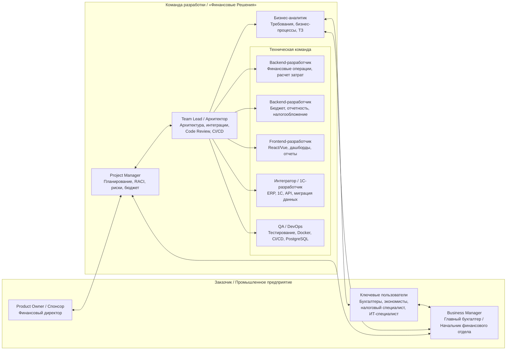
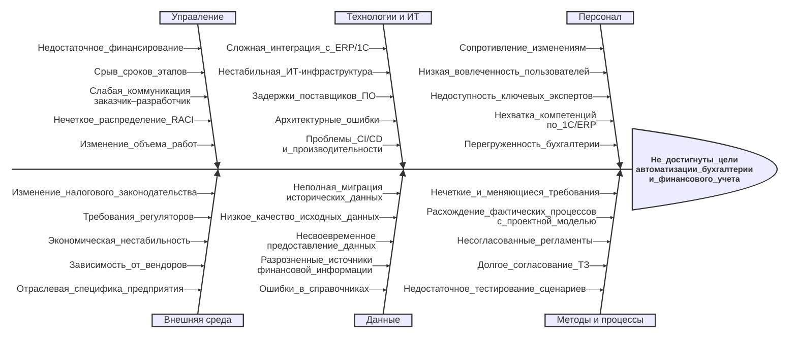

# Оглавление
- [Организационная диаграмма](#организационная-диаграмма)
- [Анализ участников проекта](#анализ-участников-проекта)
- [Три способа выявления проблем](#результаты-использования-трех-способов-выявления-проблем-с-выявленными-проблемами)
    - [1. Диаграмма Ишикавы](#1-диаграмма-ишикавы)
    - [2. SWOT-анализ](#2-swot-анализ)
    - [3. Анализ методом «5 Why»](#3-анализ-методом-5-why)
- [Логико-структурная матрица проекта](#логико-структурная-матрица-проекта)

---

# Практика 1-4
Тема: "Создание интегрированной системы автоматизации бухгалтерии и финансового учета промышленного предприятия для компании «Финансовые Решения»"

**ЭФМО-01-25**
- Коляда Даниил
- Бакланова Екатерина
- Борисов Денис

---

# Организационная диаграмма

---

# Анализ участников проекта

| Группа участников | Выгода / Интересы | Требования к участию | Механизм участия | Риски и допущения |
|-|-|-|-|-|
| **Спонсор / Заказчик** | **+** Получение точной и своевременной финансовой аналитики для стратегических решений. **+** Оптимизация бюджета и контроль затрат. **-** Риск превышения бюджета или сроков проекта. | Утверждение бюджета, стратегических целей и приемка ключевых вех. | Еженедельные статус-встречи с PM. Участие в стратегических сессиях. Утверждение отчетов. | **Риски:** Изменение приоритетов бизнеса, сокращение финансирования. **Допущения:** Заказчик участвует в процессах принятия решений и согласований, обеспечивает поддержку на уровне руководства. |
| **Главный бухгалтер / Начальник отдела бухгалетрии** | **+** Упрощение процесса закрытия периода и подготовки отчетности. **+** Снижение количества ошибок. **-** Необходимость адаптации к новым регламентам работы. | Согласование ТЗ, методологии учета и участие в приемочном тестировании. | Рабочие группы по сбору требований. Регулярные демо-презентации. Приемочные испытания. | **Риски:** Сопротивление изменениям, нечеткие требования с его стороны. **Допущения:** Выделяет ключевых экспертов для работы с бизнес-аналитиком и тестированием. |
| **Ключевые пользователи (бухгалтеры, экономисты, налоговые специалисты и т.д.)** | **+** Автоматизация рутины, удобный интерфейс, снижение нагрузки. **-** Страх сокращения штата или увеличения нагрузки в период внедрения. | Предоставление обратной связи по юзабилити, тестирование сценариев, участие в обучении. | Опросы, фокус-группы. Баг-репорты в системе трекинга. Обучение и интерактивные сессии. | **Риски:** Низкая вовлеченность, саботаж внедрения. **Допущения:** Пользователи мотивированы на улучшение условий труда и готовы учиться. |
| **IT команда заказчика** | **+** Современная, поддерживаемая ИТ-инфраструктура. **-** Дополнительная нагрузка по поддержке нового ПО и обеспечению безопасности. | Обеспечение интеграции с текущей инфраструктурой, соблюдение политик безопасности. | Технические совещания с командой разработки. Передача документации. Совместное развертывание. | **Риски:** Нехватка компетенций, конфликт с текущими ИТ-стандартами. **Допущения:** ИТ-служба готова выделить ресурсы для интеграции и тестирования. |
| **Команда разработки** | **+** Успешная реализация проекта, прибыль, укрепление репутации. **-** Переработки, риск выгорания из-за сжатых сроков. | Четкие и стабильные требования, доступ к экспертам заказчика, своевременное финансирование. | Agile-спринты (Scrum/Kanban), ежедневные статусы, ретроспективы. Демо для заказчика. | **Риски:** «Расползание» требований (scope creep), задержки со стороны заказчика. **Допущения:** Команда укомплектована необходимыми специалистами (1С, Backend, Frontend). |

---

# Результаты использования трех способов выявления проблем с выявленными проблемами

## 1. Диаграмма Ишикавы

## 2. SWOT-анализ

| **Сильные стороны** | **Слабые стороны** |
|-|-|
| 1. Автоматизация рутинных операций бухгалтерии и расчета затрат, что снижает трудозатраты. 2. Централизованное хранение данных и возможность получения финансовой аналитики в реальном времени. 3. Интеграция с существующими ERP/1С системами предприятия, что обеспечивает целостность данных. 4. Наличие специализированных модулей под нужды промышленного предприятия (бюджетирование, налогообложение). | 1. Высокая сложность интеграции с устаревшим или нестандартным ИТ-ландшафтом заказчика. 2. Значительные ресурсные и временные затраты на разработку, миграцию данных и поддержку. 3. Возможное сопротивление изменениям со стороны бухгалтеров и экономистов (привычка к старым методам). 4. Потребность в длительном обучении персонала работе с новыми модулями. 5. Жесткие требования к точности миграции и надежности хранения исторических данных. |
| **Возможности** | **Угрозы** |
| 1. Повышение качества управления финансами и скорости принятия управленческих решений. 2. Снижение операционных расходов за счет уменьшения бумажной работы и ошибок ручного ввода. 3. Масштабируемость решения — возможность предложить продукт другим промышленным предприятиям. 4. Соответствие современным тенденциям цифровизации промышленности. | 1. Изменения в законодательстве (налоги, бухучет), требующие срочной доработки системы. 2. Риск технических сбоев или потери данных в период внедрения, что может парализовать и/или повредить финансовую отчетность. 3. Необходимость гарантий ненарушения процессов аудита. 4. Срыв сроков поставщиками смежного ПО по интеграции. 5. Утечка конфиденциальных финансовых данных. |

## 3. Анализ методом «5 Why»

**Прогнозируемый риск:** Существует высокая вероятность того, что после внедрения системы бухгалтеры и экономисты вернутся к использованию старой системы (Excel) для нестандартных расчетов, что приведет к расхождениям данных и срыву сроков закрытия отчетного периода.

1. **Почему существует риск возврата к старому ПО?**
   *Потому что разрабатываемая система может не учитывать все ежедневные рабочие сценарии и нестандартные расчетные таблицы, которые рядовые специалисты используют сейчас.*
2. **Почему система может не учитывать эти сценарии?**
   *Потому что на этапе сбора требований основное внимание уделяется регламентированной отчетности для руководства, а не ежедневной рутине рядовых пользователей.*
3. **Почему на этапе сбора требований упускается рутина рядовых пользователей?**
   *Потому что в план проекта не заложены обязательные мероприятия по глубокому погружению в их работу (например, теневое наблюдение или детальные воркшопы).*
4. **Почему в план проекта не заложены такие мероприятия?**
   *Потому что команда проекта и руководство заказчика недооценивают сложность и вариативность реальных бизнес-процессов на промышленном предприятии (сложная калькуляция себестоимости).*
5. **Почему недооценивается сложность процессов?**
   *Потому что отсутствует предварительный детальный анализ бизнес-процессов (As-Is) на уровне каждого рабочего места с участием самих исполнителей.*

**Корневая причина (Root Cause):**
Отсутствие в методологии проекта обязательного этапа глубокого анализа пользовательских сценариев и вовлечения ключевых пользователей в процесс проектирования требований.

**План действий (для включения в WBS на этапе планирования):**
1. Включить в этап анализа работы по теневому наблюдению за бухгалтерами и экономистами для выявления нестандартных Excel-шаблонов.
2. Провести серию воркшопов с рядовыми пользователями для картирования их ежедневных сценариев.
3. Создать интерактивные прототипы интерфейсов для нестандартных расчетов и протестировать их на фокус-группе до начала разработки бэкенда.
4. Назначить нескольких опытных сотрудников для участия в приемке требований на этапе проектирования.

---

# Логико-структурная матрица проекта

| | **Описание** | **Показатели** | **Измерения** | **Допущения** |
|---|---|---|---|---|
| **Цель первого уровня** | Создать и внедрить интегрированную систему автоматизации бухгалтерии и финансового учета промышленного предприятия для компании «Финансовые Решения», обеспечивающую повышение точности учета, упрощение отчетности и надежную финансовую аналитику для управленческих решений. | 1. Сокращение времени закрытия отчетного периода не менее чем на 40%. 2. Снижение количества ошибок в финансовой отчетности на 90%. 3. Внедрение 100% заявленных модулей: финансовые операции, затраты, бюджет, отчетность, налогообложение. | 1. Срок проекта — 12 месяцев. 2. Утвержденный бюджет проекта. 3. Количество автоматизируемых модулей — 5. 4. Количество пользователей — не менее 50. 5. Точность финансовых данных — не ниже 99,5%. 6. Удовлетворенность пользователей — не ниже 85%. | **Риски:** сопротивление персонала изменениям; нечеткие требования заказчика; задержки интеграции с существующими ИТ-системами. **Допущения:** заказчик выделяет ключевых экспертов; финансирование поступает своевременно; доступны необходимые исторические данные. |
| **Цель второго уровня** | 1. Разработать модули учета финансовых операций и расчета затрат. 2. Разработать модуль управления бюджетом и финансового планирования. 3. Разработать модуль отчетности и налогообложения. 4. Обеспечить интеграцию системы с ИТ-ландшафтом и данными предприятия. 5. Внедрить систему, обучить пользователей и организовать поддержку. | 1. Выполнение плана разработки по 5 модулям на 100%. 2. Прохождение функционального тестирования не менее 95% сценариев. 3. Интеграция с бухгалтерскими/ERP-системами в 100% согласованных точек. 4. Обучение не менее 90% пользователей. | 1. Этапы и контрольные вехи проекта. 2. Функциональные модули системы. 3. Точки интеграции с внешними системами. 4. Роли пользователей и сценарии обучения. 5. Тестовые сценарии и приемочные испытания. | **Риски:** изменение требований в ходе проекта; нехватка данных для миграции; срыв сроков поставщиками ПО. **Допущения:** требования стабилизируются после этапа обследования; ИТ-инфраструктура заказчика стабильна; ключевые пользователи доступны для тестирования. |
| **Результаты** | 1.1. Спецификация и прототип модулей учета финансовых операций и расчета затрат утверждены. 1.2. Модули учета финансовых операций и расчета затрат разработаны и протестированы. 2.1. Модуль управления бюджетом разработан и настроен. 2.2. Подсистема бюджетного контроля и план-факт анализа внедрена. 3.1. Модуль отчетности и налогообложения разработан. 3.2. Регламентированная и управленческая отчетность автоматизирована. 4.1. Интеграционные интерфейсы с учетными системами реализованы. 4.2. Миграция исторических данных выполнена и проверена. 5.1. Система внедрена в опытную и промышленную эксплуатацию. 5.2. Пользователи обучены, регламенты поддержки переданы. | 1. Доля выполненных результатов — 100% (10/10). 2. Количество автоматизированных отчетных форм — не менее 30. 3. Доля автоматизированных операций — не менее 80%. 4. Успешное прохождение приемочных испытаний — не менее 95% сценариев. | 1. Утвержденные документы по результатам. 2. Количество модулей и отчетных форм. 3. Объем мигрированных данных. 4. Количество обученных пользователей. 5. Результаты приемочных испытаний. | **Риски:** неполная миграция данных; низкая вовлеченность пользователей; расхождение фактических процессов с проектной моделью. **Допущения:** данные предоставляются в согласованные сроки; пользователи участвуют в тестировании; регламенты согласуются с руководством. |
| **Действия** | 1.1.1. Провести обследование бизнес-процессов бухгалтерии и финансового учета. 1.2.1. Разработать техническое задание и архитектуру интегрированной системы. 2.1.1. Настроить и доработать модули учета финансовых операций, затрат и бюджета. 3.1.1. Реализовать модули отчетности и налогообложения. 4.1.1. Выполнить интеграцию с ERP/1С и миграцию данных. 5.1.1. Провести тестирование, опытную эксплуатацию и обучение пользователей. 5.2.1. Ввести систему в промышленную эксплуатацию и передать в поддержку. | 1. Утвержденное ТЗ — 1 документ. 2. Описанные бизнес-процессы — 100%. 3. Разработанные модули — 5. 4. Интеграционные сценарии — не менее 10. 5. Автоматизированные отчетные формы — не менее 30. 6. Мигрированные записи — 100% проверенных данных. 7. Обученные пользователи — не менее 90%. 8. Успешные приемочные тесты — не менее 95%. 9. Соблюдение сроков этапов — не менее 90% вех. 10. Критические дефекты после внедрения — не более 5. |  | **Риски:** изменение требований; нехватка данных для миграции; срыв сроков поставщиками. **Допущения:** доступность ключевых пользователей; своевременное финансирование; стабильная ИТ-инфраструктура. |